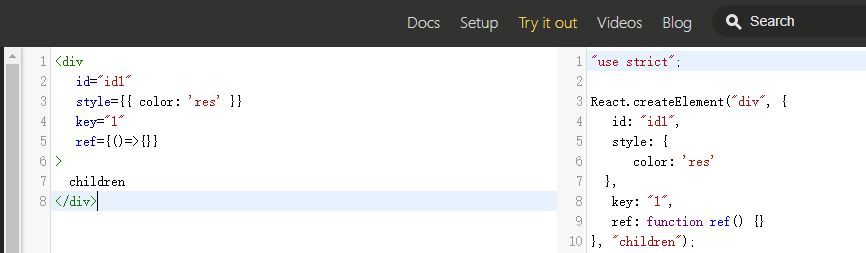
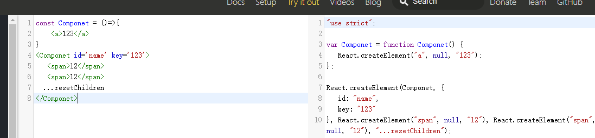

# react-source-code
&nbsp;&nbsp;&nbsp;&nbsp;&nbsp;&nbsp;断断续续算起来也看了将近一个月的,我们开门见山的说，以下我在阅读源码的时候遇到的一些问题，和一些对源码的理解。  
至于有解释得不对的地方，或者大家不能理解的一些内容，欢迎大家指正和探讨。
## 阅读前准备
首先我是在本地使用create-react-app搭建了一个简单的react项目，然后去了github上面拷贝了react的源码，其中react的源码都放在react文件夹下的packages  
文件夹中。同时在我们自己搭建的项目中，node_modules文件中可以找到react下的umd下的react.development.js这个js中存放的是打包好的react所有源码，等会  
我们就可以在这个js中去写debugegr进行调试，但是这个js是一个打包好的文件，不利于我们阅读，所以我们需要配合之前前copy下来的packages源码文件配合阅读。  
之所以这样做的呢是因为我在源码中没有发现类似可以直接run dev的命令，可以直接启动本地服务和热更新所以才多此一举，这里有了解的大佬可以一起讨论讨论。
***
## 从jsx到JavaScript的转换
jsx语法相信大家都很熟悉，但是jsx是如何被编译成javascript语法的呢。在学习源码之前我们先去看看babel是如何转换jsx  
语法的。我们在jsx中可以写类似于html标签的语法。这里有个badel在线转换工具:[babel](https://babeljs.io/),这里我们随意书写jsx语法，或者es6语法，相应的在右侧bable会为我们进行转换。例如：  
  
这里我们看到实际是调用了react下面的createElement方法,该方法接受三个参数分别为type， config， children其中type是我们的节点类型，这里如果是普通的html标签节点，则改参数为一个标签名称的字符串，但是我们如果是一个function类型的组件，则为一个变量例如下面这种情况：  
  
上面我们声明的一个function类型的Component我们看到第一个参数是一个变量，但是如果我们将大写的函数名改为小写，在转化的时  
type类型又变成一个字符串，这说明在目前babel的react插件转换的过程中，是根据首字母是否是大小写，进而判断是转换为字符  
串还是变量。config参数为一个object对象这里面保存的是我们为组件声明的一些属性，最后children大家看起来并不陌生，由于代码中的span也是一个标签所以，也调用了createElement方法，这里虽说children是一个参数，但是我们一个父级标签中的所有子集兄弟节点作为后续参数传入进来。该放方法在处理的时候会将前两个参数以外的所有参数取出来，放入一个数组中，最终作为节点的children。以上就是jsx语法的转换相关的内容。这里的createElement虽然我们在开发中从来没有用到过，但是实际上却是我们用的最多一个方法。  
## 常用API简介
&nbsp;&nbsp;&nbsp;&nbsp;&nbsp;&nbsp;接下来我们从常用的api入手，目的是搞清楚大致调用方法不用去纠结每个方法的实现过程，到后期整个梳理流程的时候会对这些东西进行逐个解释。
### (1)
