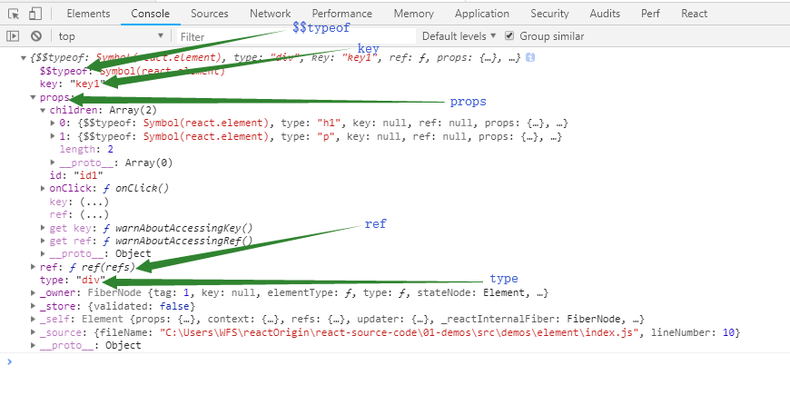
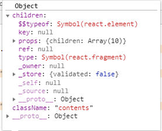
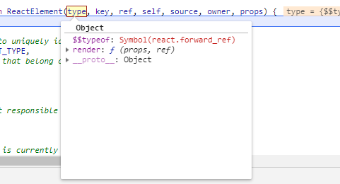

# react-source-code

&nbsp;&nbsp;&nbsp;&nbsp;&nbsp;&nbsp;断断续续算起来也看了将近一个月的,我们开门见山的说，以下我在阅读源码的时候遇到的一些问题，和一些对源码的理解。至于有解释得不对的地方，或者大家不能理解的一些内容，欢迎大家指正和探讨。

<!-- TOC -->

- [react-source-code](#react-source-code)
  - [阅读前准备](#阅读前准备)
  - [从jsx到JavaScript的转换](#从jsx到javascript的转换)
  - [常用API简介](#常用api简介)
    - [react-element](#react-element)
    - [Component&PureComponent](#componentpurecomponent)
    - [createRef&ref](#createrefref)
    - [forward-ref](#forward-ref)
    - [context](#context)

<!-- /TOC -->
***
## 阅读前准备
首先我是在本地使用create-react-app搭建了一个简单的react项目，然后去了github上面拷贝了react的源码，其中react  

的源码都放在react文件夹下的packages文件夹中。同时在我们自己搭建的项目中，node_modules文件中可以找到react下的  

cjs下的react.development.js这个js中存放的是打包好的react所有源码，等会我们就可以在这个js中去写debugegr进行  

调试，但是这个js是一个打包好的文件，不利于我们阅读，所以我们需要配合之前copy下来的packages源码文件配合阅读。之  

所以这样做的呢是因为我在源码中没有发现类似可以直接run dev的命令，可以直接启动本地服务和热更新所以才多此一举，

这里有了解的大佬可以一起讨论讨论。

***
## 从jsx到JavaScript的转换

jsx语法相信大家都很熟悉，但是jsx是如何被编译成javascript语法的呢。在学习源码之前我们先去看看babel是如何转换jsx  

语法的。我们在jsx中可以写类似于html标签的语法。这里有个badel在线转换工具:[babel](https://babeljs.io/),这里我们随意书写jsx语法，或者

es6语法，相应的在右侧bable会为我们进行转换{对babel的转换原理感兴趣的同学可以去[从babel到AST]

(https://juejin.im/post/5ab35c3cf265da23771951a2)}。例如：

  

这里我们看到实际是调用了react下面的createElement方法,该方法接受三个参数分别为type， config， children其中type  

是我们的节点类型，这里如果是普通的html标签节点，则改参数为一个标签名称的字符串，但是我们如果是一个function类型的组件，

则为一个变量例如下面这种情况：

  

上面我们声明的一个function类型的Component我们看到第一个参数是一个变量，但是如果我们将大写的函数名改为小写，

在转化的时type类型又变成一个字符串,这说明在目前babel的react插件转换的过程中，是根据首字母是否是大小写，进  

而判断是转换为字符串还是变量。config参数为一个object对象这里面保存的是我们为组件声明的一些属性，最后children  

大家看起来并不陌生，由于代码中的span也是一个标签所以，也调用了createElement方法，这里虽说children是一个  

参数,但是我们一个父级标签中的所有子集兄弟节点作为后续参数传入进来。该放方法在处理的时候会将前两个参数以外的  

所有参数取出来，放入一个数组中，最终作为节点的children。以上就是jsx语法的转换相关的内容。这里的createElement  

虽然我们在开发中从来没有用到过，但是实际上却是我们用的最多一个方法。

## 常用API简介
&nbsp;&nbsp;&nbsp;&nbsp;&nbsp;&nbsp;接下来我们从常用的api入手，目的是搞清楚大致调用方法不用去纠结每个方法的实现过程，到后期整个梳理流程

的时候会对这些东西进行逐个解释。

### react-element

我们打开下载好的packages文件夹，找到入口问价react.js。在这个js中存放的是所有react提供的api，最终将React对象export出来。
```shell
// 源码文件
import {
  createElement,
  createFactory,
  cloneElement,
  isValidElement,
} from './ReactElement'; // 这里我们看到有关element操作的方法都放在了ReactElement文件下
```
createElement方法是将jsx转换ReactElement的函数，我们在页面上把Element打印出来看到的对象就是我们的ReactElement,

假如我们有这样一段jsx代码

```shell
const Ele = (
        <div id= "id1" key="key1" ref={(refs)=>{ this.ref = refs }} onClick={()=>{console.log('click')}}>
          <h1>
            Hello
            <span>
              React
            </span>
            </h1>
          <p>React-source-code</p>
        </div>
    );
``` 
我们在页面上打印Ele：  

  

可以看到改对象下面多了跟多属性，包括一些key值和id都是我们在jsx中声明的，下面我们去看看[createElement](./react/packages/react/src/ReactElement.js)在createElement中有详细代码注释。下面我们只是大致说明改方法到底做了哪些事儿

```shell
createElement(type, [config], [children])
``` 

其中type就是组件类型可以是string或者一个变量，config是我们传入组件的属性，children为组件的内容。

在createElement方法中主要对我们传入的config参数做了处理，把除了key，和ref之外的传入属性都放入  

props中，其中也包括children。其中还包括对defaultProps的处理当处理完这些参数之后会将处理好的参数  

传入ReactElement方法，改方法很简单只是接受了这些参数，讲参数放在一个element对象中然后返回，到这里react  

就已经帮我们完成了jsx到的转换。其中比较特殊的是对于children的处理，当多层的dom嵌套的时候babel会根据我们  

的jsx层级从子集开始逐层调用createElemnt方法，然后将转换好的Reactelement对象放入父级的children中，  

像上面的例子我们babel实际是这样转换的

```shell
const Child1 = React.createElement('h1', null, 'Hello', Child2);
const Child2 = React.createElement('span', null, 'React');
const Child3 = React.createElement('p', null, 'React-source-code');
const _Ele = React.CreateElement('div', {id: 'id1', key: 'key1', ref: (refs)=>{this.ref = refs}, onClick: ....}, Child1, Child3);
```

到这一步，我们只是做了从jsx语法到ReactElement的转换，后面我们会挑重点介绍几个常用的api，其实react  

库实际只提供了不多的几个api剩下的内容都抽象到React-dom，shared，scheduler等库中去实现。

### Component&PureComponent

看到这个api想必大家再熟悉不过了，平常我们在react开发过程中写的组件都是继承自这个Component组件，  

比如我们在声明ClassComponent的时候extends的就是React.Component,在看源码只是我个人觉得写个  

class应该实现了很多复杂的功能比如说setState和render方法等，但是看了源码之后颠覆了我之前的认知[Component](./react/packages/react/src/ReactBaseClasses.js)： 
```shell

Component(props, context, updater)

```
在源码中Component方法只是简单的对props和context进行了赋值操作，这两个传入的参数我们都很熟悉，  

最后这个updater参数我们我们接触到。通过源码我们看到在Component的原型上声明了setState方法：

```shell
// 原型上声明setState方法==接受两个参数partialState待更新的state，callback回调函数
Component.prototype.setState = function(partialState, callback) {
  invariant(// 判断传入参数是否合法--包括state和callBack
    typeof partialState === 'object' ||
      typeof partialState === 'function' ||
      partialState == null,
    'setState(...): takes an object of state variables to update or a ' +
      'function which returns an object of state variables.',
  );
  // setStated的时候在component
  // 里面没有任何操作只是调用了初始化传入的this.updater里面的enqueueSetState方法
  // 将this，state，callBack，和一个字符串‘setState’传入==>个人认为这个setState为一个type
  // enqueueSetState todo? 此方法在react-dom中实现=后续
  this.updater.enqueueSetState(this, partialState, callback, 'setState');
};
```
该函数内部只是判断了传入参数的合法性最后调用了Component中updater方法上的enqueueSetState。  

然后方法结束，这里去查了一下资料，这个方法具体的实现是在react-dom中完成的。为什么要这样做呢，  

因为在react中只是简单的提供了这个方法的入口，具体的调用需要看你在哪个平台下使用，比如在react-dom  

中和在react-native中的调用肯定是不同的。在原型上也声明了

```shell

// forceUpdate-强制更新组件State方法
Component.prototype.forceUpdate = function(callback) {
  this.updater.enqueueForceUpdate(this, callback, 'forceUpdate');

};
```

看到这里我们发现只是调用了updater 的enqueueForceUpdate方法，个人认为跟字面意思一样，  

对state的进行了强制更新操作。PureComponent的用法我们不必再去赘述，该方法实际就是对Component  

方法进行了继承，但是多加了一个属性：

```shell
// 在原型上添加一个额外的isPureReactComponent属性/，标识是一个pureComponent
Object.assign(pureComponentPrototype, Component.prototype);
pureComponentPrototype.isPureReactComponent = true;
```
isPureReactComponent用来说明是一个PureComponent。最后将这两个方法导出，到这里我们有关  

Componet的源码已经完结了，我们看到在react中其实没有太多复杂的操作，只是对传入参数的赋值，  

已经留下了一些函数入口。像更新渲染等操作实际都放在了react-dom中去完成。

### createRef&ref

在开发中我们通常会有这样的需求，有时候我们需要获取某个Dom节点或者拿到classComponent类型的子组件  

的实例，进而操作这个子组件。比如说我们需要通过在父级组件中调用到子组件中的方法，从而更新子组件，这里  

的更新就不仅仅局限于更新props，通常我们跟新props也不需要获得子组件的实例。 这里通过ref这个属性  

会让我们很容易操作子组件。  

一般在现有版本中有三种使用ref的方法：

1. string 类型ref ref="string" == {不推荐，下个大版本会废弃}

2. function类型 ref = {ele => (this.childRef = ele )}

3. React.createRef()

大致用法类似于这个样子，需要注意的是我们在使用ref时候，如果目标组件是一个function类型的Component  

一般来说这个时候拿到的ref肯定是undefined，因为functionComponent是没有实例的，后面我们会介绍  

一个叫做forward-ref的属性，这个属性可以让我们取到函数类型组件上去使用ref。接下来我们去看看createRef  

方法的源码：[CreateRef](./react/packages/react/src/ReactCreateRef.js):  

这里的源码很简单只是创建了一个refObject在上面声明了一个为null的currenrt属性。然后将这个对象返回。  

其实这个源码看到这里也看不出ref到底是怎么挂载在组件的this上面的。这里应该是在react更新的过程中实现  

的，react中只有更新到结束一个完整的流程，至于到底是怎么挂载的ref我们接着往下读。

### forward-ref

通常我们会通过ref去获取Dom节点的实例，或者ClassComponent的实例,但是，如果我么们的组件是一个function类型的  

component，由于functionComponent是没有实例的所以我们在使用的时候也相应的取不到改组件的this，当然ref也一样。  

这时react为我们提供了一个forwardRef方法: 

```shell
 const TargetCom = React.forwardRef((props, ref)=>{
   <div ref={ref} {...props}/>
 });
 --------------------------------------------------
 export default class Com extends React.Component {
   constructor() {
     super();
     this.ref = React.CreateRef();
   }
   render () {
     return (<TargetCom ref={this.ref}/>);
   }
 }
```

通过这种方式创建的函数类型的组件，使我们能够在函数中继续使用ref属性，当然我们在实际的应用的中也不会  

傻到去取函数类型组件的ref，因为我们知道它是没有实例的。但是，当我们在使用其他库提供的组件的时候，  

我们可能并不知道这个这个组件的类型，这时如果能够合理的使用这个方法将会为我们省去不必要的麻烦，同时  

这里也有HOC的思想在里面。接收一个组件，返回对原组件进行包装的新的组件。接下来我们去看看方法的源码：[forwardRef](./react/packages/react/src/forwardRef.js): 

源码很简单，改方法返回了一个Oject具有render属性，同时$$typeof为"react.forward_ref"的Symbol值。  

这里可能存在对于type属性的概念混淆。我们一定不能认为使用forward创建出的组件的$$typeof属性为:   

'react.forward_ref'。我们使用forwardRef创建的组建的额时候，实际是将上面例子中的TargetCom作为参  

数传入到CreateElement方法中的，实际返回的element中的$$typeof还是REACT_ELEMENT_TYPE, 也就是说  

这里我们将TargetCom{创建出的对象--具有render和$$typeof属性}传入，其中CreateElement的type属性为  

forward方法返回的那个对象，也就是说在type对象里面有个叫做$$typeof的属性这个属性的键值为:  

 'react.forward_ref'  

,  



在后安的渲染过程中有很多判断，其中有一些就是更具$$typeof展开的，这里我们一定要搞清楚凡是通过CreateElement  

创建的组件的$$typeof属性都为: 'REACT_ELEMENT_TYPE'

### context

这里我们还是按照惯例对api进行一下简单的说明，我们知道在react中是通过props属性来实现组件间通信的，这种通信  

方式存在的问题在于，虽然父子组件之间通信很方便但是当我们的组件嵌套层级很深，这时候如果使用props传参就不太  

现实了，首先中间层的组件不一定是你自己写的其次中间层组件声明的props对于这些组件本身没有任何意义，这个时候  

我们就需要使用context方法帮助我们实现多级组件之间的通信。我们在顶层组件中提供了context对象之后，所有的后  

代组件都可以访问这个对象。以此达到跨越多层组件传递参数的功能。在react当前版本中有两种实现context的方式：

1. ParentComponent.childContextTypes{} == {不推荐，下个大版本会废弃}

2. const { Provider, Consumer } = React.createContext('default');

在使用childContextTypes时候我们需要在父级组件中声明一个getChildContext的方法，该方法返回一个对象，  

这个对象就是我们需要传给后代组件的context对象。当我们在使用第一种方法的时候我们需要在组件上声明context  

对象中属性的类型，有些类似于react的PropTypes类型检测。同时需要在使用到context的后代组件中声明  

contextTypes类似于下面这种写法：  

```shell
Child2.contextTypes = {
  value: PropTypes.string,
  a: PropTypes.string,
}

Parent.childContextTypes = {
  value: PropTypes.string,
  a: PropTypes.string,
}
```
如果不这样声明的话，在后代组价中是取不到context对象的。这里我们需要注意的是我们在子组件中使用context的时候，  

需要哪个属性就必须去contextTypes中声明，因为改组件的上级组件不止一个上级组件中的context也不止一个。而  

createContext方法的使用就简化了很多，首先我们看到改方法返回两个对象Provider, Consumer分别为context的  

提供方和订阅方。

```shell
<Provider value={this.state.newContext}>{this.props.children}</Provider>
<Consumer>{value => <p>newContext: {value}</p>}</Consumer>
```
在上层组件中声明之后，在想用到context的后代组件中国使用Consumer包括起来就可以访问到之前声明的context。  

[ReactContext](./react/packages/react/src/ReactContext.js):   

从源码中我们可以看到CreateContext方法创建了一个对象改对象有一个_currenValue属性记录context的变化，  

这个对象Provider属性中声明context，然后使改对象的Consumer属性指向对象本身，我们在使用Consumer的时候  

就直接从context的currenValue上去取值。以上就是react中的Createcontext方法的实现原理，当然实际过程并  

没有这么简单，至于具体的实现我们接着往下看。同时这里我们也需要注意该对象下的$$typeof属性并不是用来替换  

ReactElement中的$$typeof, 与我们之前将到的forwardRef中声明的$$typeof一样都只是我们传入CreateElement  

方法中type属性上的的东西。

